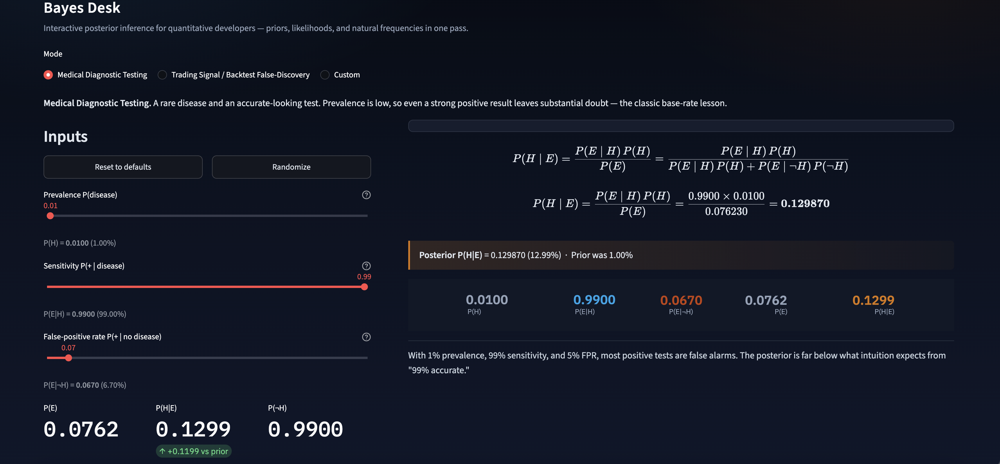
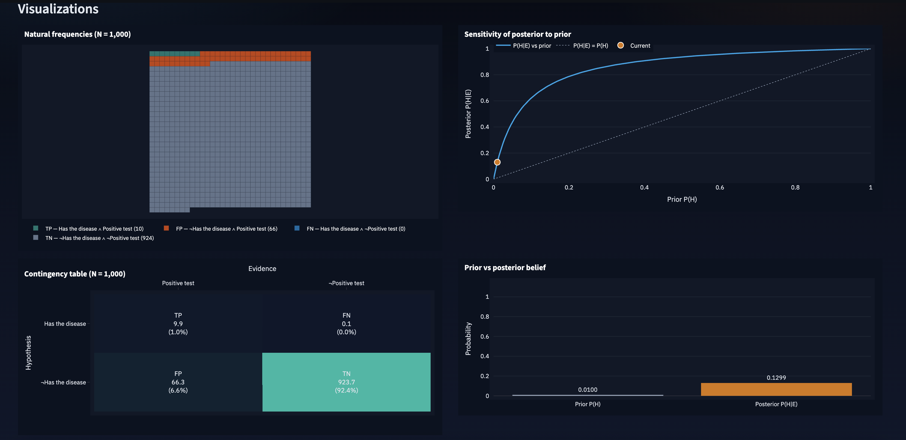

# Bayes Desk

Interactive Bayes' theorem utility for quantitative developers and analysts.
Manipulate priors and likelihoods with live LaTeX, natural-frequency grids, and
sensitivity charts.

## Screenshots





## Setup

```bash
cd quant/apps/Bayes_app
uv sync
```

## Run

```bash
uv run streamlit run bayes_app/app.py
```

Or:

```bash
uv run bayes-app
```

Open **http://127.0.0.1:8501** only. The app binds to loopback (`server.address = 127.0.0.1` in
`.streamlit/config.toml`), so it is not reachable from other devices on your LAN
(e.g. `http://192.168.x.x:8501`).

## Tests & lint

```bash
uv run pytest
uv run ruff check .
uv run black --check .
```

## The math

Bayes' theorem updates a prior after observing evidence:

\[
P(H \mid E) = \frac{P(E \mid H)\, P(H)}{P(E)}
= \frac{P(E \mid H)\, P(H)}{P(E \mid H)\, P(H) + P(E \mid \neg H)\, P(\neg H)}
\]

| Symbol | Meaning |
|---|---|
| \(P(H)\) | Prior — belief in the hypothesis before evidence |
| \(P(E \mid H)\) | Likelihood / true-positive rate / sensitivity / power |
| \(P(E \mid \neg H)\) | False-positive rate / Type I error |
| \(P(E)\) | Marginal probability of observing the evidence |
| \(P(H \mid E)\) | Posterior — belief after seeing the evidence |

When \(P(E) = 0\) (evidence impossible under both \(H\) and \(\neg H\)), the posterior
is undefined and the UI surfaces that state instead of a stack trace.

Natural frequencies for a population of size \(N\):

- TP = \(N \cdot P(H) \cdot P(E \mid H)\)
- FN = \(N \cdot P(H) \cdot (1 - P(E \mid H))\)
- FP = \(N \cdot P(\neg H) \cdot P(E \mid \neg H)\)
- TN = \(N \cdot P(\neg H) \cdot (1 - P(E \mid \neg H))\)

## Modes

| Mode | Defaults | Framing |
|---|---|---|
| Medical Diagnostic Testing | prevalence 1%, sensitivity 99%, FPR 5% | Classic base-rate neglect |
| Trading Signal / Backtest False-Discovery | true-edge rate 5%, power 90%, α 10% | False discoveries in strategy search |
| Custom | 50% / 50% / 50% | User-labeled H and E |

## Adding a new mode

1. Open `bayes_app/modes.py`.
2. Define a `ModeDefinition` with id, titles, slider labels, `ProbabilityInputs`
   defaults, and an insight string.
3. Register it in the `MODES` dict.
4. Relabel/copy only — math and visualizations are shared automatically.

Example:

```python
MY_MODE = ModeDefinition(
    id="credit",
    title="Credit Default Signal",
    description="...",
    hypothesis_label="Will default",
    evidence_label="Model flags risk",
    prior_label="Default rate P(default)",
    likelihood_label="Hit rate P(flag | default)",
    false_positive_label="False alarm P(flag | no default)",
    defaults=ProbabilityInputs(prior=0.03, likelihood=0.85, false_positive=0.08),
    insight="...",
)
MODES[MY_MODE.id] = MY_MODE
```

## Layout

```
bayes_app/
  math_core.py   # Pure Bayes functions (unit-tested)
  models.py      # Pydantic validation
  modes.py       # Scenario definitions
  viz.py         # Plotly figures
  app.py         # Streamlit UI
tests/
  test_math_core.py
ARCHITECTURE.md  # Framework decision notes
```

See [ARCHITECTURE.md](ARCHITECTURE.md) for why Streamlit + Plotly was chosen.
